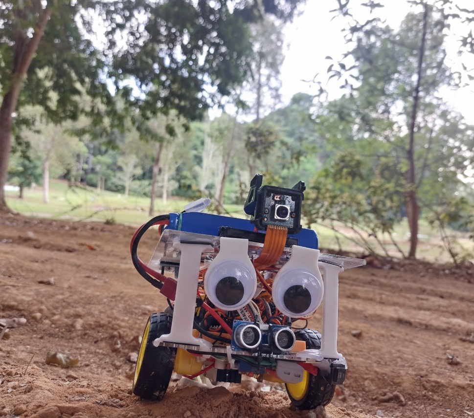

# Palanuk

> This robot is named after the [*Palanuk*](https://dtp.wikipedia.org/wiki/Palanuk), the Bornean mousedeer. A small mammal that is often told as the intelligent protagonist in [local folklore](https://www.kimaragang.net/libraries/pdfjs-dist-viewer-min/build/minified/web/viewer.html?file=%2Fsites%2Fwww.kimaragang.net%2Ffiles%2Fuploads%2FF030-KQR%255B1%255D.pdf).
> Fits the goal to cram as much intelligence possible into the small robot to fully utilize the compute power of the Pi 5 onboard.

