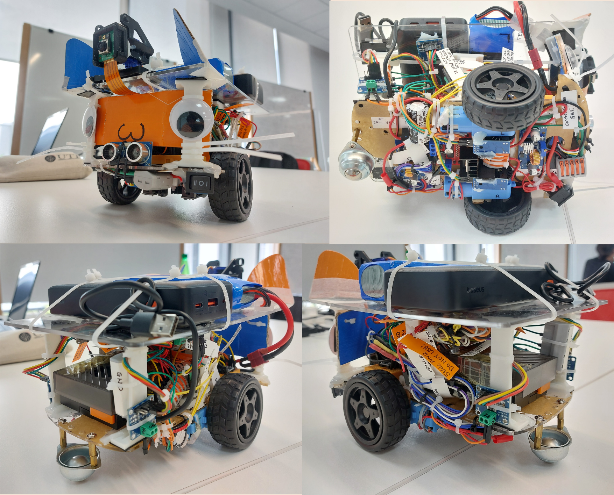

# Palanuk - ISDP Group 5

> **Our mission:** To make something as cool as as possible on a limited budget.

> Course Mission: Autonomously navigate a track, identify a correct parking spot, park, and exit the track

## What sets our team apart

* Continuous vision-based PID controller for lanekeeping and cornering
* Closed-loop motor speed PID controllers
* Consolidated control and local compute with real-time Linux (PREEMPT_RT), no separate microcontroller
* Power monitoring for both motors

    

# Team members

* Ander / [@andergisomon](https://github.com/andergisomon) - ANC (Autonomous Navigation and Control)
* Mclaren / [@MclarenFrankl1n](https://github.com/mclarenfrankl1n) - ITP (Image Transmission and Processing)
* Verossiny / [@veros03](https://github.com/veros03) - ODD (Online Data Display)
* Najdzmi / [@stxr890-oss](https://github.com/stxr890-oss) - EC (Energy Consumption)

## Supervisor

Dr. Nurul Fauzana Bt Imran Gulcharan / [@FauzanaImran](https://github.com/FauzanaImran)

# Actual owned subsystems

## Ander
Image transmission backend, control runtime, sensor and actuator drivers, lanekeeping and steering, design and tuning of PID loops

## Mclaren
Vision model training and inference pipeline, parking maneuver

## Verossiny
Dashboard from scratch, built with SvelteKit, Python Zenoh-to-Websocket bridge

## Najdzmi
PV charging station, power consumption monitoring, electrical drawings

##

##

##

> This robot is named after the [*Palanuk*](https://dtp.wikipedia.org/wiki/Palanuk), the Bornean mousedeer. A small mammal that is often told as the intelligent protagonist in [local folklore](https://www.kimaragang.net/libraries/pdfjs-dist-viewer-min/build/minified/web/viewer.html?file=%2Fsites%2Fwww.kimaragang.net%2Ffiles%2Fuploads%2FF030-KQR%255B1%255D.pdf).
> Fits the goal to cram as much intelligence possible into the small robot to fully utilize the compute power of the Pi 5 onboard.
